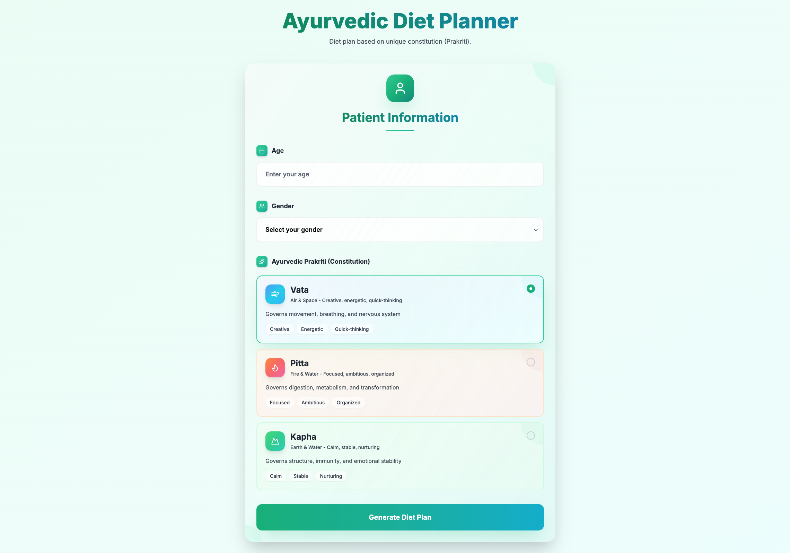

# AyurBytes: Ayurvedic Diet Planner (Proof of Concept)



## 🚀 Live Demo
🔗 [Click here to visit AyurPOC](https://ayurpoc.vercel.app/)

## 🌟 Introduction

`ayurBytes` is a Proof of Concept (POC) for an Ayurvedic Diet Management Software. This initial application demonstrates the core functionality of generating a personalized Ayurvedic diet plan based on a user's `Prakriti` (body constitution), age, and other basic health parameters.

The goal of this POC is to showcase the feasibility and potential of integrating ancient Ayurvedic wisdom with modern technology to provide personalized dietary recommendations.

## ✨ Features (Current POC)

### 🏥 1. Comprehensive Patient Management
* **Detailed Health Profiling** with 11+ parameters:
  - Personal information (Name, Age, Gender, Patient ID)
  - Physical measurements (Height, Weight, Auto-calculated BMI with category indicators)
  - Medical conditions tracking (Diabetes, Hypertension, Heart Disease, Thyroid, PCOD/PCOS, etc.)
  - Food allergies and current medications
  - Dietary habits (Vegetarian, Non-Vegetarian, Vegan, Eggetarian)
  - Meal frequency and water intake tracking
  - Lifestyle factors (Activity level, sleep hours, stress assessment)
  - Ayurvedic assessment (Bowel movements, digestion quality, Prakriti)
  - Patient data persistence (localStorage)

### 📊 2. Advanced Nutritional Analysis
* **Scientific Calculations:**
  - Daily caloric requirements using **Mifflin-St Jeor Equation**
  - Activity level multipliers (1.2x to 1.9x)
  - Macro nutrients tracking (Protein, Carbs, Fats, Fiber)
  - Micro nutrients structure (Vitamins A, C, D, B12 | Minerals: Calcium, Iron, Magnesium, Potassium, Zinc)
  - Visual progress bars with color-coded indicators
  - Percentage of daily requirements met
  - Per-serving and total nutrition display

### 🕉️ 3. Ayurvedic Intelligence
* **Prakriti-Based Diet Generation** (Vata, Pitta, Kapha)
  - Personalized food selection based on Ayurvedic principles
  - Virya (potency) and Guna (qualities) balancing
* **Six Tastes (Rasa) Balance** visualization with emojis
  - 🍯 Sweet, 🍋 Sour, 🧂 Salty, 🌶️ Pungent, 🥬 Bitter, 🫘 Astringent
* **Personalized Guidelines** based on:
  - Medical conditions
  - Bowel movement patterns
  - Digestion quality
  - Stress levels
* **Meal Timing Recommendations** aligned with digestive fire (Agni)
  - Breakfast: 7:00-9:00 AM
  - Lunch: 12:00-1:00 PM (peak Agni)
  - Dinner: 6:00-7:30 PM

### 🍽️ 4. Enhanced Food Database
* **50 food items** with complete nutritional data
* **Categories:**
  - Grains (10 items)
  - Lentils (6 items)
  - Vegetables (13 items)
  - Fruits (7 items)
  - Dairy (4 items)
  - Protein/Nuts (6 items)
  - Spices (4 items)
* **Regional Coverage:** Pan-Indian, North, South, East, West Indian foods
* **Seasonal Information:** Tagged with suitable seasons
* **Glycemic Index** data for diabetes management

### 👨‍🍳 5. Recipe-Based Diet Charts
* **5 Ayurvedic Recipes:**
  - Moong Dal Khichdi (Tridoshic, all seasons)
  - Dal Tadka (North Indian classic)
  - Palak Paneer (Iron & calcium rich)
  - Vegetable Upma (South Indian breakfast)
  - Chana Masala (High protein, diabetes-friendly)
* **Auto-Calculation:** Nutrition computed from ingredients
* **Detailed Instructions:** Step-by-step cooking guide with timing
* **Health Benefits:** Ayurvedic notes and prakriti suitability
* **Interactive UI:** Click to expand recipe details

### 📥 6. Export & Print Functionality
* **Professional PDF Generation:**
  - Patient information section
  - Nutritional summary tables
  - Complete meal plans with categories and calories
  - Meal timing recommendations
  - Ayurvedic guidelines
  - Auto-pagination with page numbers
* **Multiple Export Options:**
  - Download PDF (auto-dated filename)
  - Share PDF (WhatsApp, Email via Web Share API)
  - Print directly from browser
* **Mobile-Friendly:** Native sharing for easy distribution

### 🌍 7. Multilingual Support
* Available in **7 Indian languages:**
  - English, Hindi, Bengali, Telugu, Marathi, Tamil, Sanskrit
* Easy language switching
* Culturally appropriate translations

### 🎨 8. Modern UI/UX
* **Dual Form System:**
  - Quick Form: Basic prakriti assessment
  - Comprehensive Assessment: Full patient profiling
* **Visual Analytics:**
  - Color-coded BMI calculator
  - Progress bars for nutrition tracking
  - Gradient-themed sections
  - Emoji-based indicators
* **Responsive Design:** Works on desktop, tablet, and mobile
* **Dark Mode Ready:** Preparation for future implementation

## 🚀 Technologies Used

This POC leverages a modern web development stack:

* **Frontend:**
    * [**Next.js 15.5.4**](https://nextjs.org/) (React 19 Framework with Turbopack)
    * [**TypeScript 5**](https://www.typescriptlang.org/) (Strict mode)
    * [**Tailwind CSS 3**](https://tailwindcss.com/) (Utility-first styling)
    * [**Lucide React**](https://lucide.dev/) (Beautiful icons)
    
* **Backend:**
    * [**Next.js API Routes**](https://nextjs.org/docs/api-routes/introduction) (Serverless API endpoints)
    * TypeScript server-side logic
    
* **PDF Generation:**
    * [**jsPDF**](https://github.com/parallax/jsPDF) (PDF document generation)
    * [**jspdf-autotable**](https://github.com/simonbengtsson/jsPDF-AutoTable) (Table formatting)
    
* **Data:**
    * `foods.json` (50 items with complete nutritional data)
    * `recipes.json` (5 Ayurvedic recipes)
    * `locales/` (Multilingual translations)
    * localStorage (Patient profile persistence)

* **Development:**
    * Node.js 18+
    * npm/yarn package management
    * Git version control

## 💡 How it Works (Core Logic)

1.  **Patient Data Input:** The user provides their age, gender, and selected Prakriti through the frontend form.
2.  **API Call:** This data is sent to a Next.js API route.
3.  **Food Filtering:** The API filters the `foods.json` database based on:
    * **Prakriti Compatibility:** Foods are selected or excluded based on their `Virya` (potency) and `Guna` (qualities) to balance the chosen Prakriti.
    * **Age Suitability:** Further refinement ensures foods are appropriate for the specified age group (e.g., easier-to-digest foods for children/elderly).
4.  **Meal Assembly:** A simple algorithm then attempts to select diverse foods for Breakfast, Lunch, and Dinner from the filtered list.
5.  **Diet Plan Display:** The generated diet plan is returned to the frontend and displayed to the user.

## ⚙️ Getting Started

Follow these steps to set up and run the `ayurBytes` POC locally on your machine.

### Prerequisites

* Node.js (v18 or higher recommended)
* npm or Yarn

### Installation

1.  **Clone the repository:**
    ```bash
    git clone https://github.com/ARF9792/ayurBytes.git
    cd ayurBytes
    ```

2.  **Install dependencies:**
    ```bash
    npm install
    # or
    yarn install
    ```

### Running the Development Server

1.  **Start the development server:**
    ```bash
    npm run dev
    # or
    yarn dev
    ```

2.  **Open in browser:**
    Navigate to `http://localhost:3000` in your web browser.
